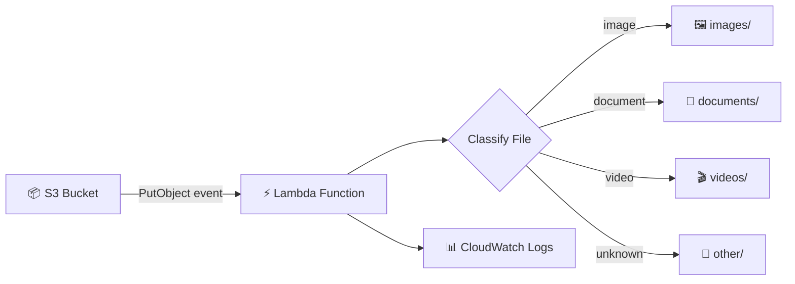

#  Serverless File Processing System using AWS & Terraform

##  Overview
This project implements a fully automated, event-driven file processing pipeline on AWS. Files uploaded to an Amazon S3 bucket are automatically classified and organized into structured folders based on file type.

The infrastructure is provisioned using Terraform, ensuring reproducibility, scalability, and adherence to DevOps best practices.

---

##  Architecture

---

##  Tech Stack

- AWS S3 — Scalable object storage  
- AWS Lambda — Serverless compute  
- AWS IAM — Secure access control  
- Terraform — Infrastructure as Code  
- CloudWatch — Monitoring & logging  

---

##  System Workflow

1. A file is uploaded to the S3 bucket  
2. S3 emits an event notification  
3. Lambda function is triggered  
4. Lambda:
   - Extracts file metadata  
   - Determines file type  
   - Moves file into appropriate folder  
5. Logs and execution metrics are recorded in CloudWatch  

---

##  File Organization Logic

| File Type | Destination |
|----------|------------|
| Images   | `images/`  |
| Documents| `documents/` |
| Videos   | `videos/`  |
| Others   | `other/`   |

---

##  Features

- Event-driven architecture  
- Fully serverless (no infrastructure management)  
- Automated file classification  
- Infrastructure as Code (Terraform)  
- Reproducible and scalable deployment  
- Secure IAM-based access control  

---

##  Setup & Deployment

### 1. Clone Repository
git clone https://github.com/
Smitty-01/s3-lambda-file-organizer.git
cd s3-lambda-file-organizer

### 2. Configure AWS CLI
aws configure

### 3. Deploy Infrastructure
terraform init
terraform apply

---

##  Testing

1. Upload a file to the S3 bucket  
2. Observe automatic file movement into categorized folders  
3. Verify execution logs in CloudWatch  

---

##  Security Considerations

- IAM roles follow least-privilege principle (recommended improvement)  
- Sensitive credentials are excluded via `.gitignore`  
- No hardcoded secrets in codebase  

---

##  Future Enhancements

- CI/CD pipeline using GitHub Actions  
- Dead Letter Queue (SQS) for failure handling  
- MIME type detection for improved accuracy  
- CloudWatch alarms and alerting  
- Multi-region deployment support  

---

##  Key Learnings

- Designing event-driven serverless systems  
- Automating cloud infrastructure using Terraform  
- Managing IAM roles and permissions securely  
- Debugging real-world cloud integration issues  

---

##  Author

Ashmit Kinariwala
